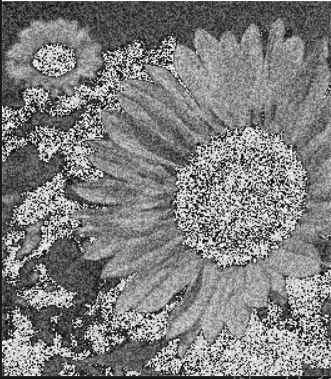
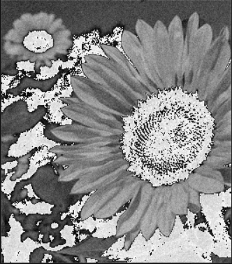
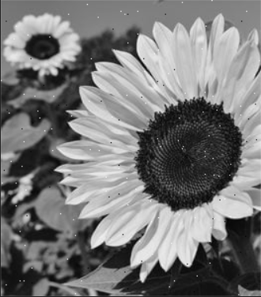
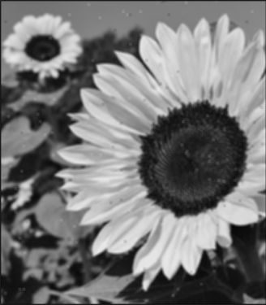
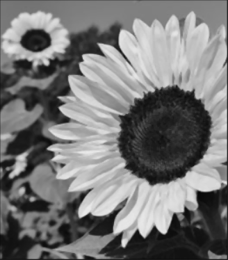
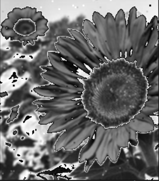
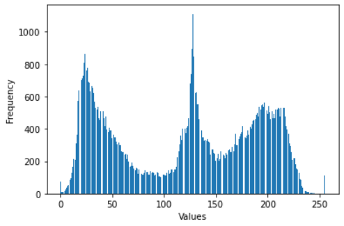
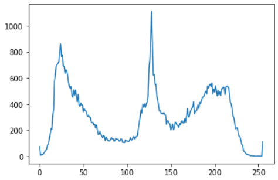

# Assignment 1 :Filtering and edge detection
## Team 5  :shipit: 

| Name          | Sec           | BN  |
| ------------- |:-------------:| -----:|
| Tarek Mohamed Rashad     | 1 | 43 |
| Abdelrahman Abobaker    | 1      |   44 |
| Ammar Alsaed Mohamed | 2      |    1 |
| Mostafa Mohamed Essam     | 2      |   28 |
| Mouaz Mohamed Hanfy | 2      |    30 |

---
---
## Report: 
1. Adding additive noise to the image:

* Uniform noise

---
* Gaussian noise 

---
* Salt & pepper noise 

---
2. Filtering the noisy image using the following low pass filters:
* Average Filter

---
* Median Filter

---
* Gauusian_Filter

---
3. Detecting edges in the image using the following masks
* in progress

---
4. Drawing histogram and distribution curve
* Histogram 

---
* Distribution Curve

---

5. Equalizing the image
* in progress
---
6. Normalizing the image 

