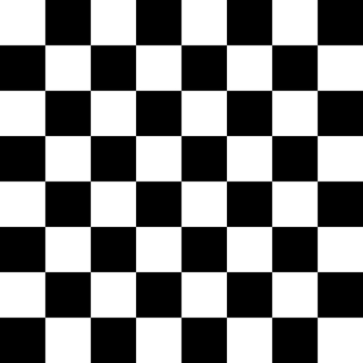

# Extracting Features using Harris operator

Finding reliable and meaningful features in images is very important for data interpretation. Edges and Corners present in images are features that have a lot of information and if correctly found they can be very helpful in a lot of computer vision tasks.

*In order to implement Harris corner detector, you can follow the following 6 steps:*

1. Calculate image x and y derivatives. For this you can apply the Sobel() function of Open-CV.
2. Derivate again the previous values to obtain the second derivative.
3. For each pixel, sum the last step obtained derivatives. Here we are making a 1 pixel sift of the windows over the image.
4. For each pixel and using the sums of the previous step, define H matrix.
5. Calculate the response of the detector.
6. Use a threshold value in order to exclude some of the detections.

Here are presented the result of Harris Corner detector implemenation. It can archive the detection of the majority of the corners, which can be adjusted by changing the threshold value.

-----------------------------------------------------------
# Generating feature descriptors using scale invariant features (SIFT)

We applied corner detectors like Harris ,etc. They are rotation-invariant, which means, even if the image is rotated, we can find the same corners. It is obvious because corners remain corners in rotated image also. But what about scaling? A corner may not be a corner if the image is scaled. For example, check a simple image below. A corner in a small image within a small window is flat when it is zoomed in the same window. So Harris corner is not scale invariant.

Scale Invariant Feature Transform (SIFT) ,Distinctive Image Features from Scale-Invariant Keypoints, which extract keypoints and compute its descriptors.

*There are mainly four steps involved in SIFT algorithm:*

1. Scale-space Extrema Detection
2. Keypoint Localization
3. Orientation Assignment
4. Keypoint Descriptor
5. Keypoint Matching

It is not necessary to show the output of SIFT algorithm, the final output is shown in the matching step.

---------------------------------------------------------
# Matching Features
We applied two Matching Algorithms, Sum Of Squared Differences (SSD) and Normalized Cross Correlations (NCC).

--------------------------------------------------------

This repository is created by a group of 5 students in Biomedical Engineering Department, Cairo University.

| Name                    | Section | B.N Number   |
|-------------------------|---------|--------------|
| Tarek Mohamed Rashad    | 1       |           43 |
| Abdelrahman Abobakr     | 1       |           44 |
| Ammar Alsaed Mohamed    | 2       |            1 |
| Mostafa Mohamed Essam   | 2       |           28 |
| Mouaz Mohamed Hanfy     | 2       |           30 |
